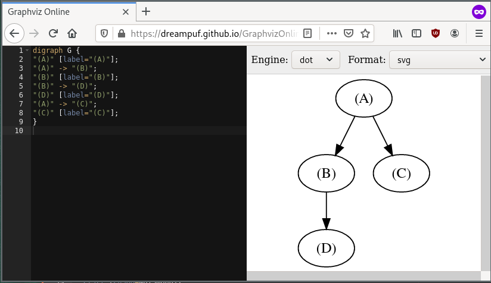

# QueryOptimization Algorithms

Either run the module itself using `python3 -m qoalgo` inside this directory or just use the jupyter notebooks provided.


```
$ python3 -m qoalgo--help
usage: qoalgo [-h] relations selectivities root

positional arguments:
  relations      A list of relations separated by a comma including their cardina lity e.g. R1:10,R2:20,R3:50
  selectivities  The selectivities for the given relations with the syntac RELATI ON1:RELATION2:SELECTIVITY e.g. R1:R2:0.4,R2:R3:0.6
  root           the root relation for the precedence graph e.g. R1

optional arguments:
  -h, --help     show this help message and exit

```

Example:

```
$ python3 -m qoalgo A:10,B:10,C:100,D:100 A:B:0.9,A:C:0.1,B:D:0.1 A

(A) 	 n: 10.0 	 s: -1.00 	C: -1.00 	 T: -1 	 rank: -1.000
(B) 	 n: 10.0 	 s: 0.90 	C: 9.00 	 T: 9.0 	 rank: 0.889
(D) 	 n: 100.0 	 s: 0.10 	C: 10.00 	 T: 10.0 	 rank: 0.900
(C) 	 n: 100.0 	 s: 0.10 	C: 10.00 	 T: 10.0 	 rank: 0.900

digraph G {
"(A)" [label="(A)"];
"(A)" -> "(B)"; 
"(B)" [label="(B)"];
"(B)" -> "(D)"; 
"(D)" [label="(D)"];
"(A)" -> "(C)"; 
"(C)" [label="(C)"];
}
(A) 	 n: 10.0 	 s: -1.00 	C: -1.00 	 T: -1 	 rank: -1.000
(B) 	 n: 10.0 	 s: 0.90 	C: 9.00 	 T: 9.0 	 rank: 0.889
(D) 	 n: 100.0 	 s: 0.10 	C: 10.00 	 T: 10.0 	 rank: 0.900
(C) 	 n: 100.0 	 s: 0.10 	C: 10.00 	 T: 10.0 	 rank: 0.900

digraph G {
"(A)" [label="(A)"];
"(A)" -> "(B)"; 
"(B)" [label="(B)"];
"(B)" -> "(D)"; 
"(D)" [label="(D)"];
"(D)" -> "(C)"; 
"(C)" [label="(C)"];
}
(A) 	 n: 10.0 	 s: -1.00 	C: -1.00 	 T: -1 	 rank: -1.000
(B) 	 n: 10.0 	 s: 0.90 	C: 9.00 	 T: 9.0 	 rank: 0.889
(D) 	 n: 100.0 	 s: 0.10 	C: 10.00 	 T: 10.0 	 rank: 0.900
(C) 	 n: 100.0 	 s: 0.10 	C: 10.00 	 T: 10.0 	 rank: 0.900

digraph G {
"(A)" [label="(A)"];
"(A)" -> "(B)"; 
"(B)" [label="(B)"];
"(B)" -> "(D)"; 
"(D)" [label="(D)"];
"(D)" -> "(C)"; 
"(C)" [label="(C)"];
}


```


Use a graphviz renderer to visualize the trees: e.g. https://dreampuf.github.io/GraphvizOnline/

